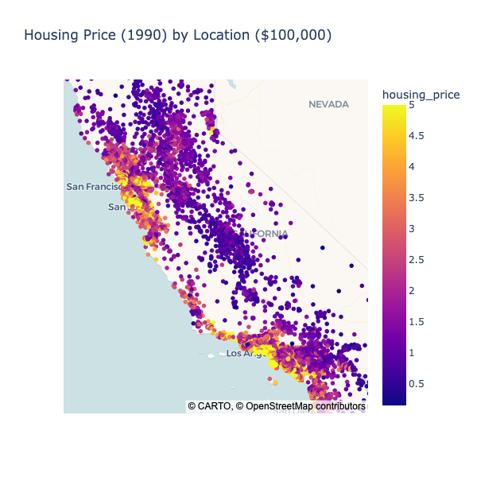
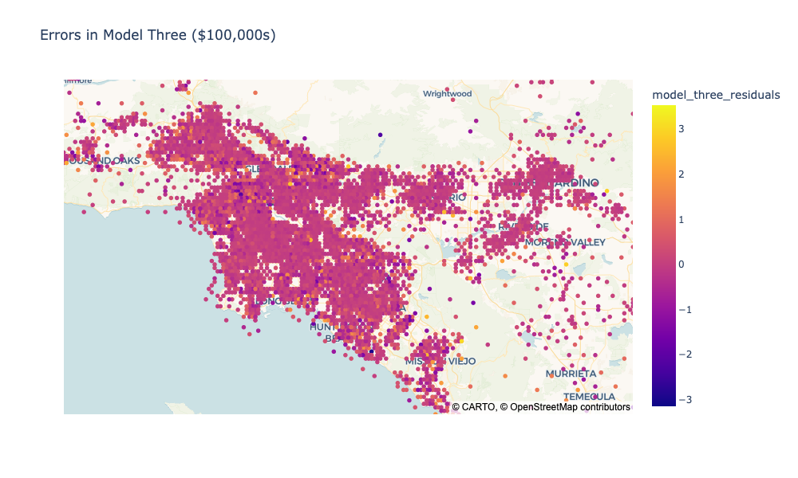
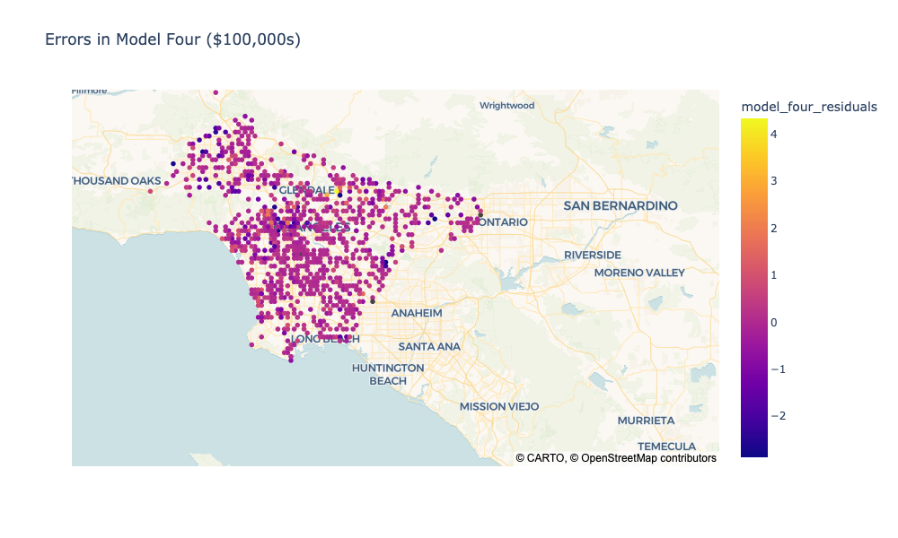

# California Housing Project

This lab shows the importance of location in the pricing of housing in California, showing that the zip code alone can account for 75% of the variation in housing prices. 
- The **first model** considers the house's simple geographic region and accounts for **20%** of the variation in housing price.
- The **second model** considers the house's distance to large cities and accounts for **25%** of variation.
- The **third model** considers the price of nearby homes and accounts for **79%** of the variation.
- The **final model** considers the average price of the home's zip code and accounts for 92% of variation in prices statewide.

These findings are illustrated in a simple [Plotly Dashboard linked here](https://jgoett2-ca-housing-project-streamlit-lkojud.streamlit.app/) and a [Tableau Dashboard linked here](https://public.tableau.com/shared/ZC8B2FJSG?:display_count=n&:origin=viz_share_link).  

This data features of 20,000 blocks of housing in California.  Using this data, we will determine whether location alone can account for variations in housing prices.

|    |   MedInc |   HouseAge |   AveRooms |   AveBedrms |   Population |   AveOccup |   Latitude |   Longitude |   housing_price |
|---:|---------:|-----------:|-----------:|------------:|-------------:|-----------:|-----------:|------------:|----------------:|
|  0 |   8.3252 |         41 |    6.98413 |     1.02381 |          322 |    2.55556 |      37.88 |     -122.23 |           4.526 |
|  1 |   8.3014 |         21 |    6.23814 |     0.97188 |         2401 |    2.10984 |      37.86 |     -122.22 |           3.585 |
|  2 |   7.2574 |         52 |    8.28814 |     1.07345 |          496 |    2.80226 |      37.85 |     -122.24 |           3.521 |
|  3 |   5.6431 |         52 |    5.81735 |     1.07306 |          558 |    2.54795 |      37.85 |     -122.25 |           3.413 |
|  4 |   3.8462 |         52 |    6.28185 |     1.08108 |          565 |    2.18147 |      37.85 |     -122.25 |           3.422 |

## EDA
 After loading the data, we see a **strong correlation** of both **Medium Income** (MedInc) and **location** with housing price.  Other features do not have a strong correlation.  The highest priced housing can be found in the San Francisco, L.A., and San Diego regions, while the lower priced housing is in the Central Valley.

|            |   Price Correlation |
|:-----------|--------------------:| 
| MedInc     |           0.688075  |
| AveRooms   |           0.151948  |
| HouseAge   |           0.105623  |
| AveOccup   |          -0.0237374 |
| Population |          -0.0246497 |
| AveBedrms  |          -0.0467005 |

 

## First Simple Model: Region of Housing
Initially, we simply model the housing price as the average housing price for each region.  This simple model can account for 20% of the variation in housing price.

| Region         |        Average Housing Price |
|:---------------|-----------------------------:|
| SF Region      |                     $283,809 |
| LA Region      |                     $239,050 |
| SD Region      |                     $197,564 |
| Central Valley |                     $107,598 |
| Other          |                     $162,839 |

This model has a high error due to large variations in housing price within a region.  To illustrate, we see the large variation in housing price in just the Los Angeles Area: 

## Second Simple Model: Inverse Distance to Top Neighborhoods
Next, we model price on the distance to 11 desirable neighborhoods in California.  The model can account for 31% of the variation in housing price.  To illustrate, we can see that model two results in smaller errors when predicting prices in the Los Angeles Region.  

## Third Model: Nearest Neighbors
We model price by considering the 5 nearest housing blocks.  This model can account for 79% of the pricing variation in California.  For example, there is much smaller error in predictions across Los Angeles in this model.

## Fourth Model: Zip Codes
We model price solely by the zip code of the home.  This model accounts for 92% of the pricing variation statewide.  To illustrate, this is very small error in the predictions of home prices across Los Angeles in this model.

## Conclusion
As we can see, location is a strong predictor of housing price.  Considering just the zip code of the home can account for 92% of the housing price variations across California.  Since housing is often built in developments of similar housing, it makes sense that the zip code would have the strongest effect on housing price.